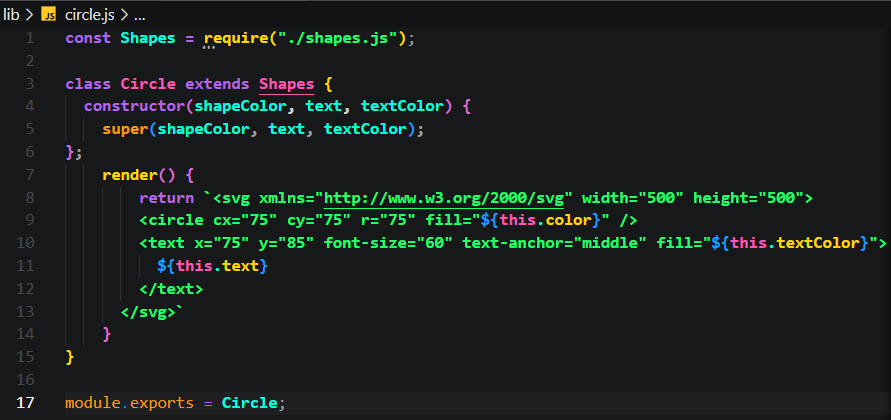

# SVG Logo Maker 🖊️
### Technologies Used

  

  
  
## Description 

[Watch a video of me demoing how it works!](https://drive.google.com/file/d/1u-KKeO58WoXT5r9w4fcma0kJDsFJ-fTu/view) 👀

Sometimes you may need a quick and simple-to-use logo maker.  At that moment you could use this program I built right here! It will generate an SVG logo. Why SVG you ask? Scalable Vector Graphics is an XML-based vector image format for defining two-dimensional graphics.  

This program is written in JavaScript.  It will ask the user to choose the shape of the logo (circle, square, or triangle), the color that shape should be filled in with, text (limit of 3 characters), and text color. Shape and text color can be any color keyword or hexadecimal number code.

## All The Prompts Answered And The Logo Made From Them

## How To Install This Project For Yourself

Check if you have Node.js installed by typing "node -v" in your command line. If node is not installed, visit the [Node.js website](https://nodejs.org/en) to install. Next, clone this project repository to your computer. Use the command "npm install" to install dependecies. Use the command "npm install --save-dev jest" to install Jest as a devDependency.

## Usage 

Once you download this Git Repository, using the terminal move into the directory where you stored those files.  Start the application by typing “node index.js”.  You will be asked a series of questions and then your logo will be generated as logo.svg. 

## Cool Stuff I Want You To Know
Not only did I code a logo generator here, I also built 3 Jest tests that are included in this Repo for your perusal.  What is a Jest test? Thank you for asking! Jest is a JavaScript testing framework that runs unit tests synchronously. It provides a number of features that make it easy to write and run tests, such as automatic test discovery, code coverage reporting, and a test runner that can be integrated with the development workflow.

I built a Jest test for each of the three logo shapes and then built three separate shape generation functions in JavaScript. See below the example of the Jest test for the Circle logo shape and its corresponding Circle shape function in JavaScript.

### Here Is The Jest Test For The Circle

### Here IS The JS Code For The Circle

### Steven Sills II 😁
If you made it all the way to here then I owe you a heartfelt "thank you" If you would like to get to know me or my work better please follow the links below. 

